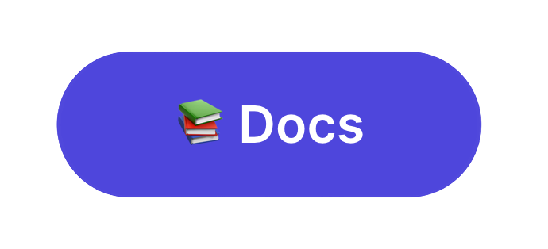

<h1 align="center">
    PanoramaJS
</h1>

<p align="center">
    
</p>
<h1 align="center">Creating captivating fullscreen snap scrolling, single-page websites with elegant landscape sliders for a seamless, immersive, and visually stunning online experience.</h1>

<p align="center">
  <a href="">
    
  </a>
</p>

PanoramaJS is a highly intuitive React library designed for effortless creation of full-page scrolling and snap interfaces. It enables developers to easily build seamless, engaging webpages, offering a rich suite of features including detailed scroll events like start and finish indicators. This library streamlines the implementation of advanced functionalities, allowing for the quick integration of dynamic, responsive scrolling experiences that enhance user interaction and the visual appeal of web projects.

## Features

- 📜 Seamless Scrolling: Smooth, fullpage scrolling and snapping for an enhanced browsing experience.
- 🔄 Dynamic Effects: Implement dynamic scrolling effects with ease.
- 📏 Responsive and Adaptive: Fully responsive design for compatibility with various devices and screen sizes.
- 🔗 Scroll Navigation: Simplified navigation through sections using scroll navigation.
- 🔧 Customizable: Extensive customization options to match your website's requirements.
- 💡 Lightweight and Efficient: Designed for performance, ensuring quick load times and smooth operation.

## Installation

Integrate PanoramaJS into your React project using npm or yarn:

```bash
npm install panoramajs --save
```

### 📚 Documentation

- Discover [our detailed documentation]() for installation guides and a complete API reference.

### 💎 Contribute

- Interested in contributing? Please read our [contributing guidelines]().
